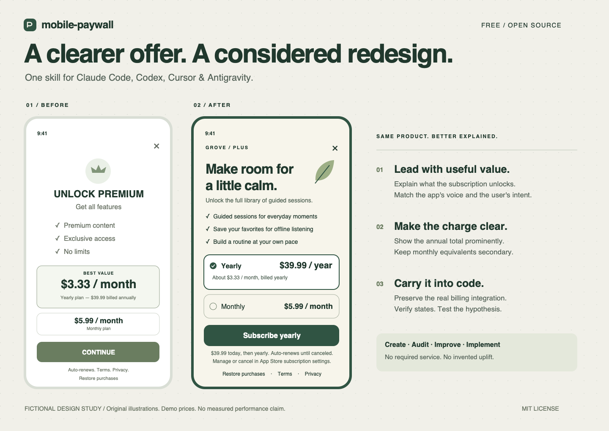

# Mobile Paywall

**Show your paywall. Get a clearer offer, a considered redesign, and code that fits your app.**

A free, MIT-licensed agent skill for **Claude Code, Codex, Cursor, and Antigravity**. Create a mobile subscription screen from a brief or improve one from screenshots and source code.



*Original fictional design study. Illustrations are not screenshots of a running app. No conversion or revenue uplift is claimed.*

[Türkçe](docs/README.tr.md) · [How it works](skills/mobile-paywall/SKILL.md) · [Example cases](examples/cases/README.md) · [Validation status](docs/validation.md)

## Start in your app

Download this repository using **Code → Download ZIP**, extract it, and open a terminal in the extracted folder. Or use GitHub's clone command from the Code menu. Requires Python 3.9+ for the optional installer.

```sh
python3 scripts/install.py --agent all --project "/path/to/your/mobile-app"
```

Replace the project path with your existing app directory. On Windows use `python` if `python3` is unavailable. Choose `claude`, `codex`, `cursor`, or `antigravity` instead of `all` for one tool. [Manual installation and updates](docs/installation.md) require no Python.

Then open your app in your agent and ask:

```text
Use the mobile-paywall skill to improve my existing paywall.
Inspect the screen and surrounding app styles. Keep my actual plans and billing integration.
Implement the redesign and explain what you verified.
```

Or attach a screenshot:

```text
Use mobile-paywall to audit this screenshot and propose a redesigned screen.
Give me exact UI copy, layout decisions, and one testable hypothesis.
Treat anything you cannot see as unknown. Do not change code yet.
```

Claude Code supports `/mobile-paywall`; Codex supports `$mobile-paywall`. Natural-language invocation is the portable starting point. See [tool setup and troubleshooting](docs/installation.md).

## What it does

| Input | Result |
| --- | --- |
| Product brief | Product-specific offer structure, visual direction, exact copy, and implementation-ready layout. |
| Existing screenshot | Evidence-based audit, prioritized changes, and a redesign specification; visual mockup when image/preview tools are available. |
| Existing mobile project | Scoped changes using the app's framework, design system, product data, and billing handlers. |
| Request for an experiment | A falsifiable hypothesis, defined metrics, and appropriate verification limits. |

The core skill is framework-independent, with implementation guidance for SwiftUI, Flutter, and React Native. This release includes a [SwiftUI UI sample](examples/swiftui/README.md); it does not bundle Flutter or React Native template apps.

## Decisions, not a universal template

- Match the message to the user's entry point and the feature being purchased.
- Show real billed totals and periods; make trial copy eligibility-aware.
- Preserve the brand, dismissal where free access exists, and purchase restoration.
- Handle unavailable products, cancellation, pending purchases, and failure recovery.
- Check compact screens, larger text, localization, and accessibility.
- Separate observed issues from design opinions and unmeasured growth hypotheses.

No invented testimonials, fake urgency, hidden fees, or promises of conversion uplift. No paywall bypassing. A screen redesign does not establish store approval or a functioning checkout.

## Free and open source

All skill instructions, references, examples, and utilities are included under [MIT](LICENSE). There is no license key, required account, telemetry, mandatory MCP server, or paid edition. Your chosen AI provider may charge for its own usage. Screenshots and code you give your agent remain subject to that provider's handling; this repository adds no upload service.

The installer only copies local skill files into your chosen project. It makes no network calls, changes no global settings, and refuses to overwrite a different existing skill.

## Develop and contribute

```sh
python3 scripts/check.py
python3 -m unittest discover -s tests -v
```

[Contributing](CONTRIBUTING.md) explains how to add an example, improve a decision rule, or test an agent. [Behavioral evaluation cases](evals/README.md) are included; structural checks alone do not prove that a model follows the skill.

Tool discovery paths are checked against official documentation. End-to-end operation in all four clients is **not yet verified**; see the [compatibility matrix](docs/validation.md). The repository includes CI for package checks on Linux, Windows, and macOS, plus iOS sample type-checking on macOS.
