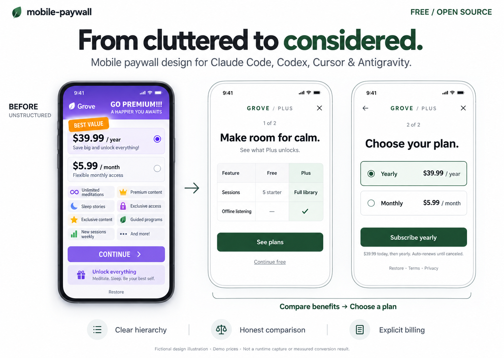

<div align="center">

# Mobwall

### Better mobile paywalls, inside your coding agent.

Design a new subscription screen. Audit an existing one. Implement it in your app.

**Claude Code · Codex · Cursor · Antigravity**

[](LICENSE)
[](docs/installation.md)
[](#platforms-and-languages)

**English** · [Türkçe](docs/README.tr.md)

[Install](#install) · [Try it](#try-it) · [Examples](#platforms-and-languages) · [Evidence](#reported-in-production) · [Validation](docs/validation.md)

</div>



<p align="center"><sub>Illustrative design study, not an actual agent-run before/after or a conversion result. Fictional app and demo prices.</sub></p>

## What you get

| Start with | Get back |
| :--- | :--- |
| A screenshot | An audit grounded in visible details, proposed copy and a layout specification. |
| A product brief | A design that explains the paid value and the actual commitment. |
| An existing app | Scoped UI changes using your framework, product data and billing service. |
| A test question | A hypothesis, a meaningful metric and checks you can actually run. |

**A skill is a set of instructions for your coding agent.** It is not a standalone design app or a billing SDK. Visual mockups depend on the tools available in your agent. Your existing purchase service remains responsible for checkout and verified access.

## Install

Download or clone this repository, then run from its root:

```sh
python3 scripts/install.py --agent all --project "/absolute/path/to/your-app"
```

Choose `cursor`, `claude`, `codex` or `antigravity` instead of `all` to install for one agent. The target app folder must already exist. Python 3.9+ is needed only for this installer; on Windows, use `python` if needed.

| Agent | Installed location in your app | Invoke |
| :--- | :--- | :--- |
| Claude Code | `.claude/skills/mobwall/` | `/mobwall` |
| Codex | `.agents/skills/mobwall/` | `$mobwall` |
| Cursor | `.agents/skills/mobwall/` | Select `mobwall` from `/` in Agent chat |
| Antigravity | `.agents/skills/mobwall/` | Ask to use the `mobwall` skill |

Restart the agent in your app after installing. The installer copies local files, makes no network calls and preserves different/customized existing copies. Discovery paths are documented; full task execution in all four clients has not been independently verified.

<details>
<summary><strong>No Python? Install manually · Updating an older copy?</strong></summary>

Copy the entire [mobwall skill folder](skills/mobwall), including `references/`, into the destination above. The resulting path must end in `mobwall/SKILL.md`.

For an update, move your previous skill folder to a backup location outside all skill-discovery directories, then install the new copy. The installer intentionally refuses to overwrite a different version. Avoid duplicate copies in `.cursor/skills` and `.agents/skills`.

[Full installation and troubleshooting](docs/installation.md)

Installed the earlier `mobile-paywall` release? Follow the [rename migration](docs/installation.md#rename-migration) to avoid duplicate skill discovery.

</details>

## Try it

**Audit first:** attach your screenshot and send this in your app project.

```text
Use mobwall to audit my current paywall.
Read the relevant skill references and inspect my screen and code.
Keep actual products, prices and trial eligibility.
Give me prioritized findings and a concrete redesign. Do not change code yet.
```

**Then implement:**

```text
Use mobwall to implement the proposed design in this app.
Preserve my state management, navigation and billing integration.
Use ✓/— for included/not-included features and text for numeric limits.
Keep screen-reader labels, restore, dismissal and renewal terms clear.
Run the relevant checks and explain what remains unverified.
```

No app yet? Open one of the examples below, or provide a brief with audience, free/paid features, plans, trial terms and target platform. Unknown prices stay visibly provisional.

## Platforms and languages

| Platform / framework | Code language | Included example | What has been checked locally |
| :--- | :--- | :--- | :--- |
| **Flutter** · iOS / Android hosts | Dart | [Two-step paywall](examples/flutter/README.md) | Analysis, 8 widget tests; web build and browser review on recorded revisions |
| **Android** · Jetpack Compose | Kotlin | [Native demo](examples/android/README.md) | Debug APK build |
| **iOS** · SwiftUI | Swift | [Native screen](examples/swiftui/README.md) | macOS type-check and hosted preview; iOS build not run locally |
| React Native | JavaScript / TypeScript | [Integration guidance](skills/mobwall/references/implementation.md) | No bundled app or platform test |

**Documentation:** English and [Türkçe](docs/README.tr.md). **Demo UI:** English. The skill follows the requested product locale and existing localization files; translated production interfaces are not bundled or certified for every locale.

## A clearer journey

**Understand the context → compare the value → explain the offer → verify the result.**

For broad onboarding design, include a purposeful two-screen candidate alongside a control:

| 01 · Value | 02 · Offer |
| :--- | :--- |
| Explain what upgrading changes. Use ✓/— for binary features and real text for limits. | Show the total billed amount, actual period, eligible terms and selected-plan CTA. |
| Keep an accessible free exit. | Preserve Back, close, restoration and legal links. |

A narrow copy fix stays narrow. A high-intent feature gate does not automatically need another page. The table and extra screen are design choices to test, not guaranteed improvements.

[Worked design](examples/cases/grove-two-step.md) · [Source ledger](skills/mobwall/references/research.md) · [All example briefs](examples/cases/README.md)

## Reported in production

The developer reports that an Android app using this skill received in-app purchases in these Google Play Console markets:

| United States | United Kingdom | India | Türkiye |
| :---: | :---: | :---: | :---: |
|  |  |  |  |

| Kazakhstan | Finland | Belgium |
| :---: | :---: | :---: |
|  |  |  |

[Developer-reported case and evidence status](docs/country-case-study.md). The underlying records have not been independently reviewed for this repository. This reports geographic reach, not conversion uplift.

## What is verified

**15 installer tests · 8 Flutter widget tests · 16 authored evaluation scenarios.** These are different checks: the scenarios are rubrics, not 16 completed independent agent runs. The developer supplied one Cursor audit output; it is not a four-client compatibility benchmark.

See the [validation record](docs/validation.md) for exact versions and limits. Real store purchase flows, native screen-reader behavior and full client compatibility still need separate validation. No enterprise support SLA or measured uplift is claimed.

<details>
<summary><strong>Run repository checks</strong></summary>

```sh
python3 scripts/check.py
python3 -m unittest discover -s tests -v
```

Flutter analysis/tests and platform build instructions live with each example. [Contributing](CONTRIBUTING.md) · [Evaluation protocol](evals/README.md)

</details>

## Responsibility and misuse

Mobwall is provided for design and implementation assistance. You are responsible for how you use it, what you ship, and whether your app complies with store rules, consumer law, privacy rules, tax rules, and other applicable requirements. The project maintainers are not responsible for unlawful use, misleading offers, rejected app submissions, refunds, chargebacks, lost revenue, lost profits, business interruption, or any other loss or damage connected to using this project.

## Free to use, including commercially

Original project content is [MIT licensed](LICENSE). No account, license key, telemetry or required connector. Your AI provider may charge for usage. Sample billing callbacks perform no real payments.

[Gradle attribution](examples/android/gradle/README.md) · [Flutter scaffold license](examples/flutter/FLUTTER_LICENSE) · [Flag artwork attribution](assets/flags/README.md)

If this helps you ship, report an issue or contribute a reproducible example. Useful feedback beats an unverified success claim.
